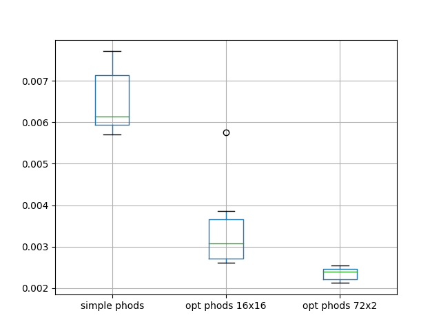

# Ζητούμενο 1ο
## Ερωτημα 1
| Λειτουργικό Σύστημα | Έκδοση πυρήνα Linux |
|---|--|
| Ubuntu 18.04 LTS | 4.15.0.72 |

| L1d cache | L1i cache | L2 cache | L3 cache | RAM | Cores per socket | Threads per core| CPU Freq |
| :-: | :-: | :-: | :-: | :-: | :-: | :-: | :-:|
| 32K | 32K | 256K | 8192K | 8G | 4 | 2 | 625.122 MHz |

>Τα παραπάνω βρέθηκαν με χρήση των εντολών:
```console
$ uname -a
$ lscpu
$ lshw -short
```  

## Ερωτημα 2
Για τον υπολογισμό του χρόνου εκτέλεσης της συνάρτησης ***phods_motion_estimation()***, η οποία καταλαμβάνει το μεγαλύτερο μέρος του χρόνου εκτέλεσης του αλγορίθμου, ενσωματώθηκε η συνάρτηση ***gettimeofday()*** στον αρχικό κώδικα.


```c
void phods_motion_estimation(int current[N][M], int previous[N][M],
    int vectors_x[N/B][M/B],int vectors_y[N/B][M/B])
{
    double time;
    struct timeval ts,tf;
    gettimeofday(&ts,NULL);
    int x, y, i, j, k, l, p1, p2, q2, distx, disty, S, min1, min2, bestx, besty;

    .
    .
    .

    gettimeofday(&tf,NULL);
    time=(tf.tv_sec-ts.tv_sec)+(tf.tv_usec-ts.tv_usec) * 0.000001;
    printf("%lf\n", time);
}
```
Εκτελώντας το  Python script,
```console
$ python3 time.py phods 10
```

παίρνουμε 10 μετρήσεις για το χρόνο εκτέλεσης της ***phods_motion_estimation()***.

|Μέτρηση|Χρόνος (sec)
|:-:|:-:|
|1|0.006229|
|2|0.006223|
|3|0.006094|
|4|0.006143|
|5|0.007439|
|6|0.007150|
|7|0.006117|
|8|0.006336|
|9|0.008273|
|10|0.006904|

|Minimum|Maximum|Average|
|:-:|:-:|:-:|
|0.006094 sec|0.008273 sec|0.006691 sec|

## Ερωτημα 3

###### Merged x and y
Aρχικά παρατηρείται πως τα κομμάτια που υπολογίζουν τα ***distx*** και ***disty*** βρίσκονται σε βρόχους εκτέλεσης με ίδια άκρα και είναι ανεξάρτητα μεταξύ τους. Συνεπώς τα κάναμε **merge** σε έναν κοινό βρόχο.

```c
for(k=0; k<B; k++)
{
    for(l=0; l<B; l++)
    {
        p1 = current[B*x+k][B*y+l];

        if((B*x + vectors_x[x][y] + i + k) < 0 ||
        (B*x + vectors_x[x][y] + i + k) > (N-1) ||
        (B*y + vectors_y[x][y] + l) < 0 ||
        (B*y + vectors_y[x][y] + l) > (M-1))
        {
            p2 = 0;
        } else {
            p2 = previous[B*x+vectors_x[x][y]+i+k][B*y+vectors_y[x][y]+l];
        }

        if((B*x + vectors_x[x][y] + k) <0 ||
        (B*x + vectors_x[x][y] + k) > (N-1) ||
        (B*y + vectors_y[x][y] + i + l) < 0 ||
        (B*y + vectors_y[x][y] + i + l) > (M-1))
        {
            q2 = 0;
        } else {
            q2 = previous[B*x+vectors_x[x][y]+k][B*y+vectors_y[x][y]+i+l];
        }

        distx += abs(p1-p2);
        disty += abs(p1-q2);
    }
}
```

Αυτό, βέβαια, έδωσε μία ανεπαίσθητη βελτίωση στο χρόνο που όμως λόγω της μικρής απόκλισης που έχουν ούτως η άλλως οι μετρήσεις, είναι δύσκολο να προσδιοριστεί.

Ύστερα παρατηρήσαμε ότι μέσα στα loops των x και y, τα ***S*** και ***i*** δεν κάνουν loop εώς κάποιο όριο που εξαρτάται από το input, αλλά πάνω σε σταθερές τιμές, οπότε χρησιμοποιήσαμε macros για να τα κάνουμε **unroll**.

###### Loop unrolling
```c
for(x=0; x<N/B; x++)
{
    for(y=0; y<M/B; y++)
    {
        FOR_LOOP_S(4);
        FOR_LOOP_S(2);
        FOR_LOOP_S(1);
    }
}
```

###### FOR_LOOP_I(i)
```c
#define FOR_LOOP_I(i)                                                           \
    distx = 0;                                                                  \
    disty = 0;                                                                  \
    for(k=0; k<B; k++)                                                          \
    {                                                                           \
        for(l=0; l<B; l++)                                                      \
        {                                                                       \
            p1 = current[B*x+k][B*y+l];                                         \
            if((B*x + vectors_x[x][y] + i + k) < 0 ||                           \
            (B*x + vectors_x[x][y] + i + k) > (N-1) ||                          \
            (B*y + vectors_y[x][y] + l) < 0 ||                                  \
            (B*y + vectors_y[x][y] + l) > (M-1))                                \
            {                                                                   \
                p2 = 0;                                                         \
            } else {                                                            \
                p2 = previous[B*x+vectors_x[x][y]+i+k][B*y+vectors_y[x][y]+l];  \
            }                                                                   \
            if((B*x + vectors_x[x][y] + k) <0 ||                                \
            (B*x + vectors_x[x][y] + k) > (N-1) ||                              \
            (B*y + vectors_y[x][y] + i + l) < 0 ||                              \
            (B*y + vectors_y[x][y] + i + l) > (M-1))                            \
            {                                                                   \
                q2 = 0;                                                         \
            } else {                                                            \
                q2 = previous[B*x+vectors_x[x][y]+k][B*y+vectors_y[x][y]+i+l];  \
            }                                                                   \
            distx += abs(p1-p2);                                                \
            disty += abs(p1-q2);                                                \
        }                                                                       \
    }                                                                           \
    if(distx < min1)                                                            \
    {                                                                           \
        min1 = distx;                                                           \
        bestx = i;                                                              \
    }                                                                           \
    if(disty < min2)                                                            \
    {                                                                           \
        min2 = disty;                                                           \
        besty = i;                                                              \
    }                                                                           
```

###### FOR_LOOP_S(s)
```c
#define FOR_LOOP_S(s)                                                           \
    min1 = 255*B*B;                                                             \
    min2 = 255*B*B;                                                             \
    FOR_LOOP_I(-s);                                                             \
    FOR_LOOP_I(0);                                                              \
    FOR_LOOP_I(s);                                                              \
    vectors_x[x][y] += bestx;                                                   \
    vectors_y[x][y] += besty;
```

Αυτό, όμοια με το προηγούμενο loop merging έκανε το πρόγραμμα ελάχιστα καλύτερο.

Τέλος, παρατηρήθηκε πώς στις παραπάνω μακροεντολές γίνεται πρόσβαση σε στοιχείο του πίνακα **vectors_x[x][y]** πολλαπλές φορές μέσα σε κάθε επανάληψη, χωρίς αυτό να έχει αλλάξει τιμή. Οι εντολές πρόσβασης στη μνήμη είναι, ως γνωστόν, αυτές που επιβαρύνουν περισσότερο την εκτέλεση ενός προγράμματος. Γι' αυτό τροποποιήθηκε ο κώδικας ώστε αυτό το στοιχείο να υπολογίζεται μόνο μία φορά σε κάθε επανάλυψη του συνολικού διπλού βρόχου. Ύστερα χρησιμοποιείται απλά σαν τιμή μεταβλητής.

```c
for(x=0; x<N/B; x++)
{
    for(y=0; y<M/B; y++)
    {
        int __vectors_x__ = vectors_x[x][y];
        FOR_LOOP_S(4);
        FOR_LOOP_S(2);
        FOR_LOOP_S(1);
    }
}
```
Στη συνέχεια αντικαταστήσαμε και στις μακροεντολές FOR_LOOP_I και FOR_LOOP_S με ***\_\_vectors_x__*** όπου ***vectors_x[x][y]***, παίρνοντας έτσι τον τελικό βελτιστοποιημένο κώδικα ***phods_opt.c***.

Εκτελώντας το  Python script,
```console
$ python3 time.py phods_opt 10
```

παίρνουμε τώρα το μέσο χρόνο εκτέλεσης της ***phods_motion_estimation()*** για τον βελτιστοποιημένο κώδικα, o οποίος είναι **0.003063 sec**.

|phods.c (average)|phods_opt.c (average)|Βελτίωση|
|:-:|:-:|:-:|
|0.006691 sec| **0.003063 sec** | 54%|

## Ερώτημα 4
Για την εύρεση του βέλτιστου **Block size** χρειάστηκε η τροποποίηση του κώδικα ώστε να δέχεται σαν παράμετρο το μέγεθος **B**.

```c
if (argc == 1)
{
    B = 16;
}
else if (argc == 2)
{
    B = atoi(argv[1]);
}
else
{
    printf("phods_optimized usage: ./phods block_size\n");
    exit(1);
}
```

Ύστερα τρέχοντας
```console
$ python3 block.py phods_opt 10
```
παίρνουμε μετρήσεις για τον χρόνο εκτέλεσης ανάλογα με το μέγεθος του Block. Επιλέχθηκαν μεγέθη Β που είναι διαιρέτες του Μ(176) και Ν(144).

|Μέγεθος Block| Mέσος χρόνος εκτέλεσης|
|:-:|:-:|
|1|0.005813|
|2|0.004046|
|4|0.003349|
|8|0.003317|
|16|0.003266|

H καλύτερη επίδοση επιτυγχάνεται για μέγεθος Block 16.

## Eρώτημα 5
Για την αναζήτηση του καλύτερου Block size, ερευνάται πλέον και Block όχι τετραγωνικό, αλλά ορθογώνιο, διαστάσεων **Βx x Βy**.

Για αυτόν τον σκοπό έγινε και η τελική προσαρμογή του κώδικα ώστε να δέχεται πλέον 2 διαφορετικές διαστάσεις για το Block. Αυτός υπάρχει στο αρχείο ***phods_opt_2dimensions.c***. Τώρα τρέχουμε το ίδιο script με όρισμα το νέο εκτελέσιμο, ώστε να ερευνήσουμε όλους τους πιθανούς συνδυασμούς των Bx και By, όπου αυτά είναι οι διαιρέτες των Ν και Μ αντίστοιχα.
```console
$ python3 block.py phods_opt_2dimensions 10
```

με output

```console
Block size 1 x 1 : 0.005696 sec
Block size 1 x 2 : 0.005639 sec
Block size 1 x 4 : 0.005520 sec
Block size 1 x 8 : 0.005523 sec
Block size 1 x 11 : 0.005404 sec
Block size 1 x 16 : 0.005450 sec
Block size 1 x 22 : 0.005545 sec
Block size 1 x 44 : 0.005698 sec
Block size 1 x 88 : 0.005284 sec
Block size 1 x 176 : 0.005492 sec
Block size 2 x 1 : 0.004215 sec
Block size 2 x 2 : 0.004365 sec
Block size 2 x 4 : 0.004381 sec
Block size 2 x 8 : 0.004276 sec
Block size 2 x 11 : 0.004322 sec
Block size 2 x 16 : 0.004441 sec
Block size 2 x 22 : 0.004345 sec
Block size 2 x 44 : 0.004382 sec
Block size 2 x 88 : 0.004373 sec
Block size 2 x 176 : 0.004597 sec
Block size 3 x 1 : 0.003958 sec
Block size 3 x 2 : 0.003870 sec
Block size 3 x 4 : 0.003835 sec
Block size 3 x 8 : 0.003658 sec
Block size 3 x 11 : 0.003746 sec
Block size 3 x 16 : 0.003796 sec
Block size 3 x 22 : 0.003761 sec
Block size 3 x 44 : 0.003844 sec
Block size 3 x 88 : 0.003775 sec
Block size 3 x 176 : 0.003821 sec
Block size 4 x 1 : 0.003781 sec
Block size 4 x 2 : 0.003561 sec
Block size 4 x 4 : 0.003654 sec
Block size 4 x 8 : 0.003609 sec
Block size 4 x 11 : 0.003688 sec
Block size 4 x 16 : 0.003569 sec
Block size 4 x 22 : 0.003626 sec
Block size 4 x 44 : 0.003591 sec
Block size 4 x 88 : 0.003703 sec
Block size 4 x 176 : 0.003620 sec
Block size 6 x 1 : 0.003572 sec
Block size 6 x 2 : 0.003358 sec
Block size 6 x 4 : 0.003682 sec
Block size 6 x 8 : 0.003593 sec
Block size 6 x 11 : 0.003359 sec
Block size 6 x 16 : 0.003417 sec
Block size 6 x 22 : 0.003365 sec
Block size 6 x 44 : 0.003470 sec
Block size 6 x 88 : 0.003456 sec
Block size 6 x 176 : 0.003437 sec
Block size 8 x 1 : 0.003306 sec
Block size 8 x 2 : 0.003490 sec
Block size 8 x 4 : 0.003377 sec
Block size 8 x 8 : 0.003526 sec
Block size 8 x 11 : 0.003136 sec
Block size 8 x 16 : 0.003275 sec
Block size 8 x 22 : 0.003511 sec
Block size 8 x 44 : 0.003601 sec
Block size 8 x 88 : 0.003332 sec
Block size 8 x 176 : 0.003442 sec
Block size 9 x 1 : 0.003197 sec
Block size 9 x 2 : 0.003561 sec
Block size 9 x 4 : 0.003053 sec
Block size 9 x 8 : 0.003262 sec
Block size 9 x 11 : 0.003433 sec
Block size 9 x 16 : 0.003448 sec
Block size 9 x 22 : 0.003326 sec
Block size 9 x 44 : 0.003192 sec
Block size 9 x 88 : 0.003124 sec
Block size 9 x 176 : 0.003206 sec
Block size 12 x 1 : 0.003140 sec
Block size 12 x 2 : 0.003172 sec
Block size 12 x 4 : 0.003448 sec
Block size 12 x 8 : 0.003083 sec
Block size 12 x 11 : 0.003137 sec
Block size 12 x 16 : 0.003137 sec
Block size 12 x 22 : 0.003290 sec
Block size 12 x 44 : 0.003304 sec
Block size 12 x 88 : 0.003169 sec
Block size 12 x 176 : 0.003223 sec
Block size 16 x 1 : 0.003170 sec
Block size 16 x 2 : 0.003163 sec
Block size 16 x 4 : 0.003304 sec
Block size 16 x 8 : 0.003074 sec
Block size 16 x 11 : 0.003204 sec
Block size 16 x 16 : 0.003247 sec
Block size 16 x 22 : 0.003245 sec
Block size 16 x 44 : 0.003261 sec
Block size 16 x 88 : 0.003299 sec
Block size 16 x 176 : 0.003133 sec
Block size 18 x 1 : 0.002835 sec
Block size 18 x 2 : 0.003026 sec
Block size 18 x 4 : 0.003132 sec
Block size 18 x 8 : 0.003144 sec
Block size 18 x 11 : 0.003247 sec
Block size 18 x 16 : 0.003406 sec
Block size 18 x 22 : 0.003207 sec
Block size 18 x 44 : 0.003038 sec
Block size 18 x 88 : 0.003035 sec
Block size 18 x 176 : 0.002932 sec
Block size 24 x 1 : 0.003172 sec
Block size 24 x 2 : 0.003134 sec
Block size 24 x 4 : 0.002981 sec
Block size 24 x 8 : 0.003130 sec
Block size 24 x 11 : 0.003322 sec
Block size 24 x 16 : 0.002953 sec
Block size 24 x 22 : 0.003060 sec
Block size 24 x 44 : 0.003101 sec
Block size 24 x 88 : 0.003400 sec
Block size 24 x 176 : 0.003032 sec
Block size 36 x 1 : 0.002654 sec
Block size 36 x 2 : 0.002767 sec
Block size 36 x 4 : 0.002861 sec
Block size 36 x 8 : 0.002827 sec
Block size 36 x 11 : 0.002771 sec
Block size 36 x 16 : 0.002981 sec
Block size 36 x 22 : 0.002808 sec
Block size 36 x 44 : 0.002760 sec
Block size 36 x 88 : 0.002942 sec
Block size 36 x 176 : 0.002649 sec
Block size 48 x 1 : 0.002887 sec
Block size 48 x 2 : 0.002872 sec
Block size 48 x 4 : 0.002641 sec
Block size 48 x 8 : 0.002656 sec
Block size 48 x 11 : 0.002621 sec
Block size 48 x 16 : 0.002671 sec
Block size 48 x 22 : 0.002634 sec
Block size 48 x 44 : 0.002744 sec
Block size 48 x 88 : 0.002694 sec
Block size 48 x 176 : 0.002700 sec
Block size 72 x 1 : 0.002613 sec
Block size 72 x 2 : 0.002538 sec
Block size 72 x 4 : 0.002633 sec
Block size 72 x 8 : 0.002714 sec
Block size 72 x 11 : 0.002734 sec
Block size 72 x 16 : 0.002651 sec
Block size 72 x 22 : 0.002820 sec
Block size 72 x 44 : 0.002828 sec
Block size 72 x 88 : 0.002565 sec
Block size 72 x 176 : 0.002588 sec
Block size 144 x 1 : 0.002569 sec
Block size 144 x 2 : 0.002629 sec
Block size 144 x 4 : 0.002688 sec
Block size 144 x 8 : 0.002626 sec
Block size 144 x 11 : 0.002642 sec
Block size 144 x 16 : 0.002634 sec
Block size 144 x 22 : 0.002603 sec
Block size 144 x 44 : 0.002587 sec
Block size 144 x 88 : 0.002583 sec
Block size 144 x 176 : 0.002575 sec

Best block size: 72 x 2 : 0.002538 sec
```
Φαίνεται λοιπόν πως οι βέλτιστες διαστάσεις του Block είναι **72x2**.
Bέβαια, επισημαίνεται, πως οι μετρήσεις παρουσιάζουν μία μικρή διακύμανση, όπως προαναφέρθηκε. Αυτό σε συνδυασμό με τα παραπάνω αποτελέσματα, που είναι τόσο κοντά κάποιες επιδόσεις από διαφορετικές διαστάσεις καθιστά το παραπάνω αποτέλεσμα ορθό με μία πιθανότητα μικρότερη της μονάδας.

## Ερώτημα 6
Tρέχοντας το script boxplot.py
```console
$ python3 boxplot.py
```

παίρνουμε το boxplot των μετρήσεων του χρόνου εκτέλεσης της ***phods_motion_estimation()*** για τους παρακάτω κώδικες:
- phods.c
- phods_opt.c για Β = 16
- phods_opt_2dimensions.c για Bx = 72 και By = 2

Είναι προφανής η υπεροχή του βελτιστοποιημένου κώδικα σε σχέση με τον απλό. Επίσης φαίνεται μια μικρή αλλα υπαρκτή βελτίωση όταν επιλεχθεί ορθόγωνιο Block διαστάσεων 72x2, με την προαναφερθήσα επισήμανση για την ορθότητα των επιλεγμένων αυτών διαστάσεων όμως.


# Ζητούμενο 2ο
