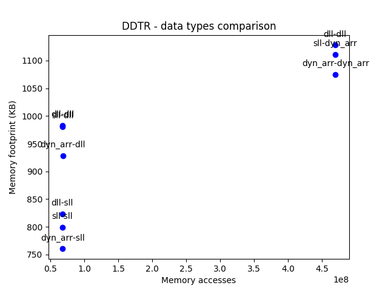
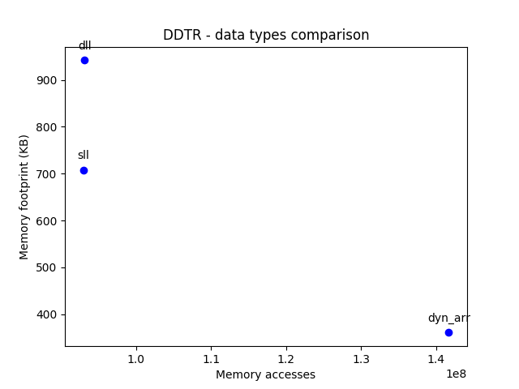

# Σχεδίαση Ενσωματωμένων Συστημάτων
## 2η εργαστηριακή άσκηση 2019-2020
## ΝΤΟΥΡΟΣ ΕΥΑΓΓΕΛΟΣ 03112905

*Σημείωση:*
*Έγινε χρήση του compliler gcc-4.8.*

# Άσκηση 1
#### a.
Στο αρχείο **dll.h** προσθέτοντας-αφαιρώντας σχόλια στο σημείο
```c
#define SLL_CL
//#define DLL_CL
//#define DYN_ARR_CL

#define SLL_PK
//#define DLL_PK
//#define DYN_ARR_PK
```
παράγουμε εκτελέσιμα για τον συγκεκριμένο κώδικα και για τους 9 συνδυασμούς δυναμικών δομών δεδομένων.
```console
$ gcc-4.8 drr.c -o drr-sll-sll -pthread -lcd
sl -L./../synch_implementations -I./../synch_implementations

$ gcc-4.8 drr.c -o drr-sll-dll -pthread -lcd
sl -L./../synch_implementations -I./../synch_implementations

$ gcc-4.8 drr.c -o drr-sll-dyn -pthread -lcd
sl -L./../synch_implementations -I./../synch_implementations

$ gcc-4.8 drr.c -o drr-dll-sll -pthread -lcd
sl -L./../synch_implementations -I./../synch_implementations

$ gcc-4.8 drr.c -o drr-dll-dll -pthread -lcd
sl -L./../synch_implementations -I./../synch_implementations

$ gcc-4.8 drr.c -o drr-dll-dyn -pthread -lcd
sl -L./../synch_implementations -I./../synch_implementations

$ gcc-4.8 drr.c -o drr-dyn-sll -pthread -lcd
sl -L./../synch_implementations -I./../synch_implementations

$ gcc-4.8 drr.c -o drr-dyn-dll -pthread -lcd
sl -L./../synch_implementations -I./../synch_implementations

$ gcc-4.8 drr.c -o drr-dyn-dyn -pthread -lcd
sl -L./../synch_implementations -I./../synch_implementations
```

- drr-sll-sll
- drr-sll-dll
- drr-sll-dyn
- drr-dll-sll
- drr-dll-dll
- drr-dll-dyn
- drr-dyn-sll
- drr-dyn-dll
- drr-dyn-dyn

Tρέχοντας το bash script
```console
$ chmod +x script.sh
$ ./script.sh
```
παράγονται τα αρχεία **memory_accesses.txt** και **memory_footprint.txt**, τα οποία περιέχουν πληροφορία η οποία συνοψίζεται παρακάτω:

|Node_struct|Packet_struct|Memory accesses|Memory footprint|
|:-:|:-:|:-:|:-:|
|SLL|SLL|67058967|798.8 KB|
|SLL|DLL|67696447|980.3 KB|
|SLL|DYN_ARR|469222244|1111 KB|
|DLL|SLL|67069137|823 KB|
|DLL|DLL|67706225|983.3 KB|
|DLL|DYN_ARR|469238457|1128 KB|
|DYN_ARR|SLL|67587245|760.2 KB|
|DYN_ARR|DLL|68245731|928.5 KB|
|DYN_ARR|DYN_ARR|469946613|1075 KB|



#### b.
Oι ***ελάχιστες προσβάσεις στη μνήμη*** επιτυγχάνονται με τον συνδυασμό **simple linked list και simple linked list**.

#### c.
Το ***ελάχιστο memory footprint*** επιτυγχάνεται με τον συνδυασμό **dynamic array και simple linked list**, που τυχαίνει να είναι και η βέλτιστη κατα **pareto** λύση.

# Άσκηση 2
#### a.
Eκτελούμε την εφαρμογή και βλέπουμε το output:

```console
$ ./dijkstra input.dat

Shortest path is 1 in cost. Path is:  0 41 45 51 50
Shortest path is 0 in cost. Path is:  1 58 57 20 40 17 65 73 36 46 10 38 41 45 51
Shortest path is 1 in cost. Path is:  2 71 47 79 23 77 1 58 57 20 40 17 52
Shortest path is 2 in cost. Path is:  3 53
Shortest path is 1 in cost. Path is:  4 85 83 58 33 13 19 79 23 77 1 54
Shortest path is 3 in cost. Path is:  5 26 23 77 1 58 99 3 21 70 55
Shortest path is 3 in cost. Path is:  6 42 80 77 1 58 99 3 21 70 55 56
Shortest path is 0 in cost. Path is:  7 17 65 73 36 46 10 58 57
Shortest path is 0 in cost. Path is:  8 37 63 72 46 10 58
Shortest path is 1 in cost. Path is:  9 33 13 19 79 23 77 1 59

Shortest path is 0 in cost. Path is:  10 60
Shortest path is 5 in cost. Path is:  11 22 20 40 17 65 73 36 46 10 29 61
Shortest path is 0 in cost. Path is:  12 37 63 72 46 10 58 99 3 21 70 62
Shortest path is 0 in cost. Path is:  13 19 79 23 77 1 58 99 3 21 70 55 12 37 63
Shortest path is 1 in cost. Path is:  14 38 41 45 51 68 2 71 47 79 23 77 1 58 33 13 92 64
Shortest path is 1 in cost. Path is:  15 13 92 94 11 22 20 40 17 65
Shortest path is 3 in cost. Path is:  16 41 45 51 68 2 71 47 79 23 77 1 58 33 32 66
Shortest path is 0 in cost. Path is:  17 65 73 36 46 10 58 33 13 19 79 23 91 67
Shortest path is 1 in cost. Path is:  18 15 41 45 51 68
Shortest path is 2 in cost. Path is:  19 69
```
#### b.
Eισάγουμε τη βιβλιοθήκη και κάνοντας τις απαραίτητες αλλαγές καταλήγουμε στο αρχείο dijkstra_opt.c το οποίο αποτελεί τη βελτιστοποιημένη μορφή του αρχικού αλγορίθμου.

Όμοια με την **Άσκηση 1**, προσθέτοντας-αφαιρώντας σχόλια στο κομμάτι κώδικα του αρχείου **dijkstra_opt.c**

```c
#define SLL
//#define DLL
//#define DYN_ARR
```
και με χρήση του Μakefile παράγονται τα 3 βελτιστοποιημένα εκτελέσιμα για τον αλγόριθμο dijkstra.
* dijkstra_opt_sll
* dijkstra_opt_dll
* dijkstra_opt_dyn_arr

#### c.
Tρέχοντας
```console
$ chmod +x script.sh
$ ./script.sh
```
παίρνουμε τις παρακάτω μετρήσεις για το **memory footprint** και τα **memory accesses** των 3 αυτών βελτιστοποιημένων εκτελεσίμων.

|Node_struct|Memory accesses|Memory footprint|
|:-:|:-:|:-:|
|SLL|92943465|707.7 KB|
|DLL|93150336|941.8 KB|
|DYN_ARR|141722318|360.7 KB|



#### d.
Oι ***ελάχιστες προσβάσεις στη μνήμη*** επιτυγχάνονται με την υλοποίηση με **simple linked list**.

#### e.
Το ***ελάχιστο memory footprint*** επιτυγχάνεται με την υλοποίηση με **dynamic array**.
